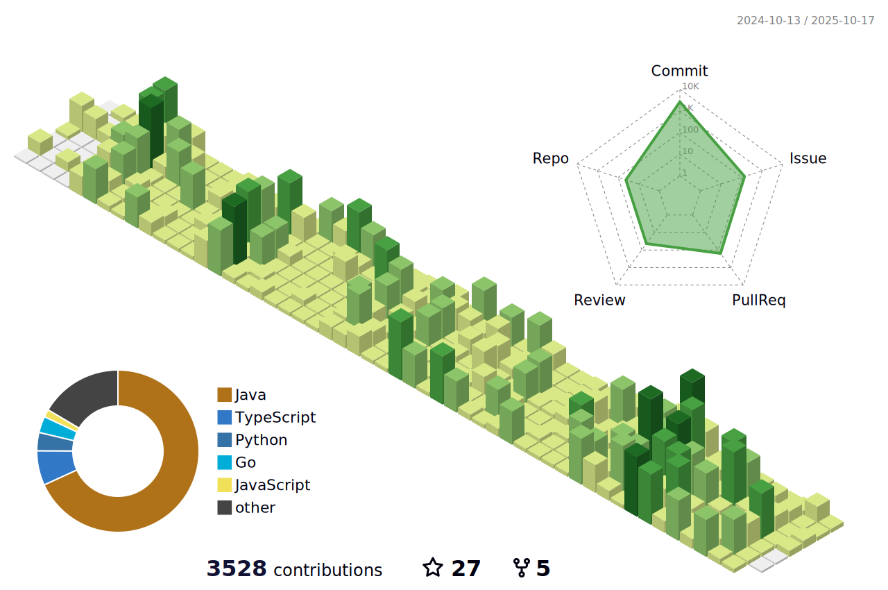

## Introduction

I am a **backend engineer** who enjoys tackling **new challenges**. While I have not participated extensively, I continuously **contribute to open source projects**, striving to write **clean, efficient, and maintainable code**. My contributions to **Spring Framework** and **Spring Data JPA** reflect my focus on improving **code readability, performance, and memory efficiency**.

Beyond coding, I am passionate about **fostering a positive developer culture**. As a [**Google Developer Group on Campus (GDGoC) KNU, 5th term Organizer**](https://github.com/orgs/GDG-on-Campus-KNU), I have **organized community events, shared knowledge, and mentored other developers**.

## Open Source Contributions

| No | Project          | Contribution                                                                                                                                                                                               | PR      | Role                  | Date                                                                         |
| -- | ---------------- | ----------------------------------------------------------------------------------------------------------------------------------------------------------------------------------------------------------- | -------- | -------------------- | --------------------------------------------------------------------------- |
| 1  | Spring Framework | Simplified `FilteredIterator` implementation by removing unnecessary `else` statements and streamlining `if` structures for improved readability                                                             | [PR #33902](https://github.com/spring-projects/spring-framework/pull/33902)| Contributor & Author  | Nov 2024|
| 2  | Spring Framework | Simplified `spring-core` utility implementation: added early returns, removed unnecessary `else` blocks, unified code formatting                                                                           | [PR #33903](https://github.com/spring-projects/spring-framework/pull/33903) | Contributor & Author | Nov 2024|
| 3  | Spring Framework | Optimized `SockJsFrame#toString` method: reduced repeated string creation from 2+ times to 1, fixed `StringBuilder` capacity to minimize memory allocation, improving GC efficiency and memory usage       | [PR #35510](https://github.com/spring-projects/spring-framework/pull/35510)   | Contributor & Author | Sep 2025|
| 4  | Spring Data JPA  | Improved parent lookup in recursive entity structure: replaced recursive calls (risking stack overflow) with `while` loop to traverse parent nodes, reducing stack usage and potential performance overhead   | [PR #4025](https://github.com/spring-projects/spring-data-jpa/pull/4025)   | Contributor & Author | Sep 2025|

## Awards

| Description                                         | Organization                                             | Award        | Date     |
| :-------------------------------------------------- | :------------------------------------------------------- | :----------- | :------- |
| 2023 Daegu-Gyeongbuk Public Data Hackathon     | Software Education Center, Kyungpook National University | Grand Prize  | Oct 2023 |
| 2023 Daegu Shining SW Hackathon                          | Kyungpook National University (Computer)                 | Grand Prize  | Nov 2023 |
| 2024 Daegu Shining SW Hackathon                     | Kyungpook National University (Computer)                 | Grand Prize  | Sep 2024 |
| KIPS Spring Integrated Conference                   | Korea Information Processing Society (KIPS)              | Bronze Prize | Jun 2024 |
| KIPS Fall Integrated Conference                     | Korea Information Processing Society (KIPS)              | Gold Prize   | Nov 2024 |
| Daegu Regional Industry Performance Exchange        | Daegu Digital Innovation Promotion Agency                | Grand Prize  | Nov 2024 |
| Daegu Industry-Academia Cooperation Project Contest | Daegu Digital Innovation Promotion Agency                | Grand Prize  | Nov 2024 |
| Open SW Development Portfolio Contest               | Kyungpook National University (Computer)                 | Bronze Prize | Nov 2024 |

