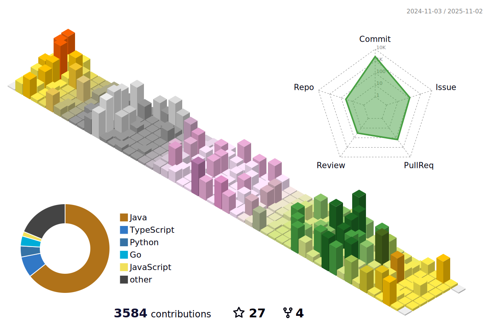

  
## 😎Intoduction

안녕하세요. 소프트웨어 엔지니어 강태현입니다. 새로운 기술을 배우는 것을 즐기며, 웹 개발에 대한 큰 흥미를 가지고 있습니다.

`백엔드`와 `프론트엔드`를 넘어서 시스템 전반을 이해하며 문제를 해결하는 과정에서 더 큰 만족을 느낍니다. 계속해서 성장하고, 다양한 기술을 배우며 발전하는 것을 목표로 하고 있습니다. 

## 🌟Shortcut
<table>
    <tr >
      <td align="center" width="150px"><strong>Project</strong></td>
      <td align="center" width="150px"><strong>Experience</strong></td>
      <td align="center" width="150px"><strong>My Skill</strong></td>
      <td align="center" width="150px"><strong>My Certification</strong></td>
    </tr>
    <tr>
      <td align="center" width="150px"><a href="./project.md">🕶️Go to</a></td>
      <td align="center" width="150px"><a href="./experience.md">🕶️Go to</a></td>
      <td align="center" width="150px"><a href="./my-skill.md">🕶️Go to</a></td>
      <td align="center" width="150px"><a href="./certification.md">🕶️Go to</a></td>
    </tr>
 </table>

